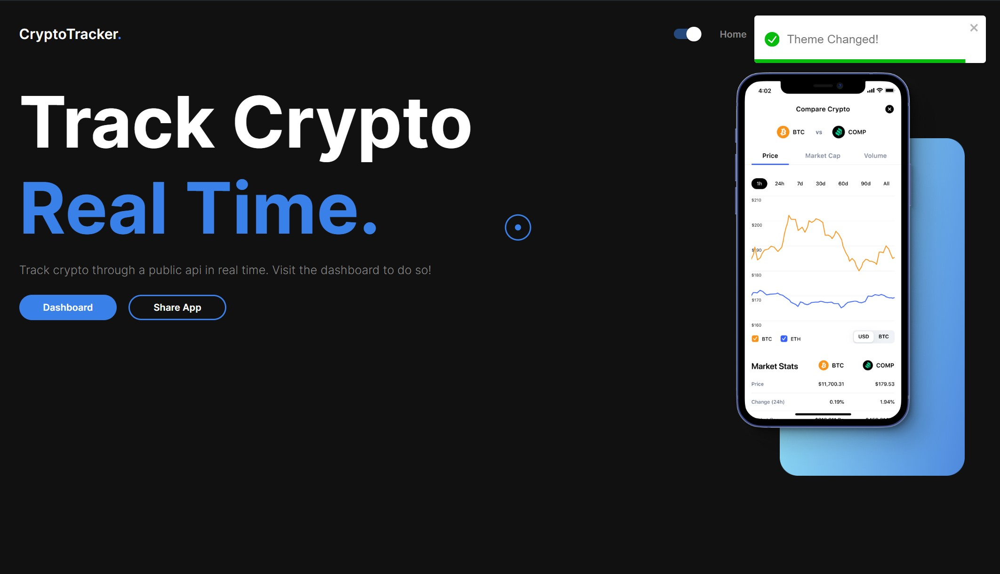
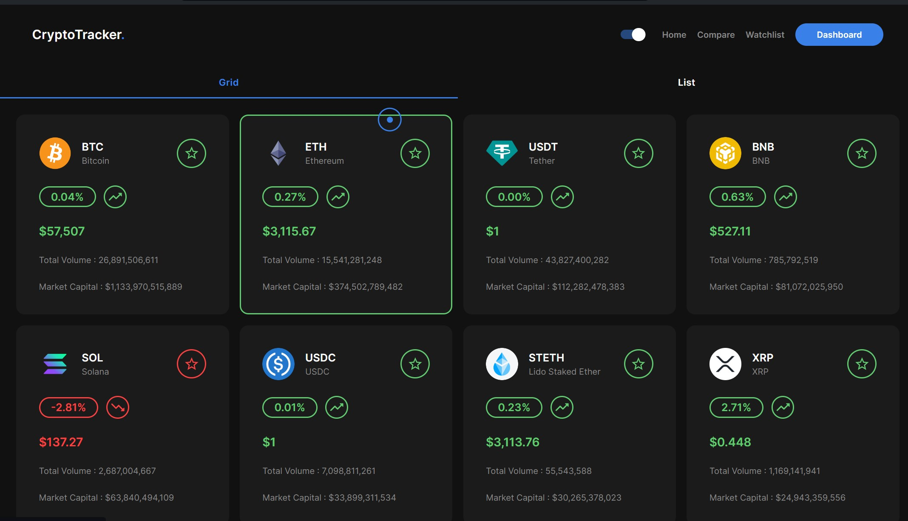
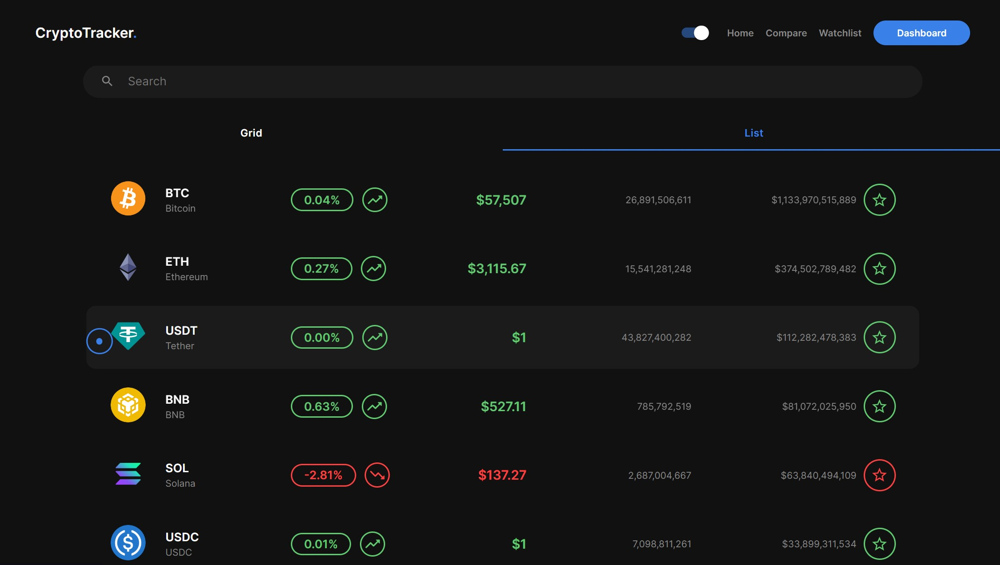
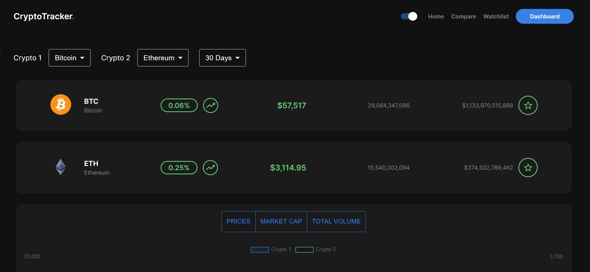
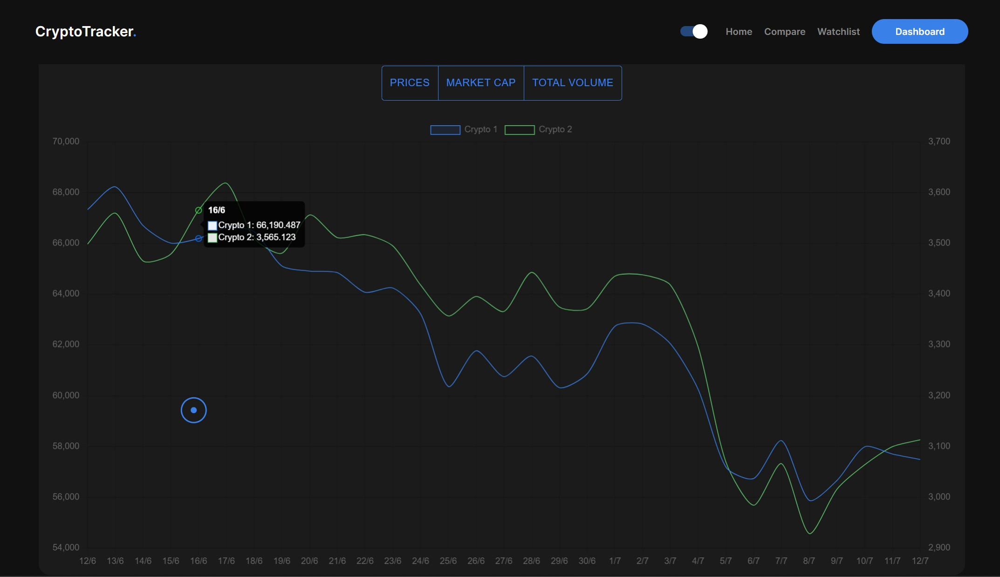
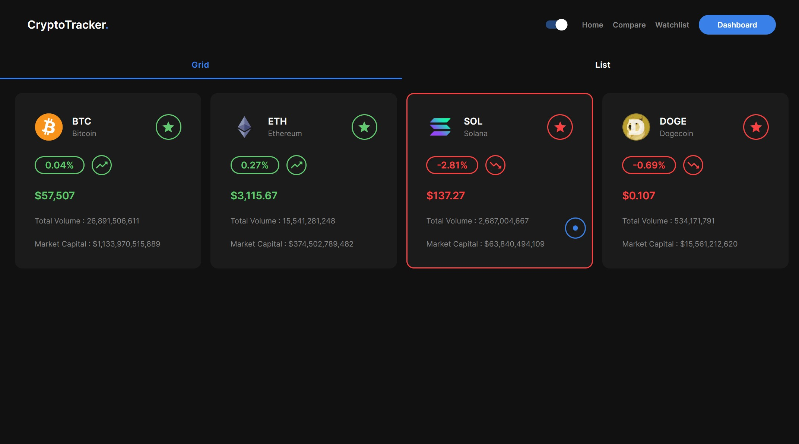

# Crypto Tracking 

A Crypto Tracking website designed to provide real-time updates, historical data, and detailed analytics for various cryptocurrencies.

## Technologies Used

- HTML
- CSS
- JavaScript
- React.js
- Chart.js
- Framer motion

## Demo

## User Interface

## Features

   - Real-Time Data: Stay up-to-date with the latest prices and trends for a wide range of cryptocurrencies.

   - Interactive Charts: Visualize market trends with intuitive and interactive charts and graphs.

   - Favorite Coins: Easily track your favorite cryptocurrencies by adding them to your watchlist.

   - Compare Two Coins: Compare the performance and metrics of two selected cryptocurrencies side-by-side.

   - Added the functionality of Toggle ON/OFF Dark Mode.

## Contact

For suggestions and feedback contact me at [Abhinav_git](https://github.com/UltimateAbhinav)

